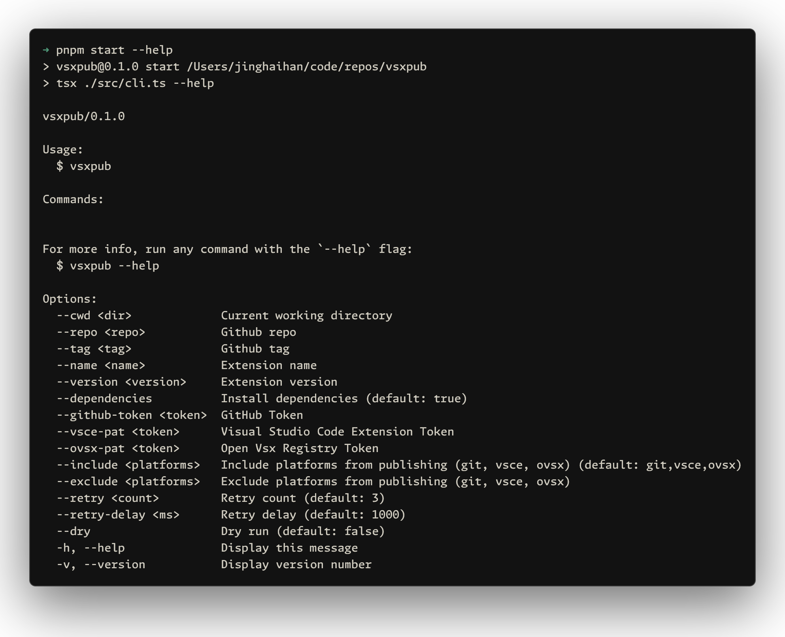

# vsxpub

[![npm version][npm-version-src]][npm-version-href]
[![bundle][bundle-src]][bundle-href]
[![JSDocs][jsdocs-src]][jsdocs-href]
[![License][license-src]][license-href]

A CLI tool for publishing VS Code extensions to the Marketplace, OpenVSX, and GitHub Releases.

## Usage

```sh
npx vsxpub
```

You can skip publishing to specific platforms by using the `--include` or `--exclude`. exclude is higher priority than include.

Examples:
- Local development: `npx vsxpub --exclude git` to skip GitHub releases
- CI/CD pipeline: `npx vsxpub --include git` to avoid configuring secrets

<p align='center'>

</p>

## Environment Variables

Required environment variables:
- `GITHUB_TOKEN` - GitHub personal access token
- `VSCE_PAT` - VS Code Marketplace personal access token
- `OVSX_PAT` - OpenVSX registry personal access token

For local development, follow the [Visual Studio Marketplace](https://code.visualstudio.com/api/working-with-extensions/publishing-extension#get-a-personal-access-token) and [Open VSX Registry](https://github.com/eclipse/openvsx/wiki/Publishing-Extensions#1-create-an-access-token) documentation to set up personal access tokens. For CI/CD, add these as GitHub repository `secrets` or skip specific platforms.

## GitHub Actions Integration

### Important: Release Page Creation

**Before using `vsxpub`, ensure that your GitHub release page has been created.** You can use tools like [`changelogithub`](https://github.com/antfu/changelogithub) to automatically create release pages with changelogs.

### Example Workflow

```yaml
name: Publish Extension

permissions:
  contents: write

on:
  push:
    tags:
      - 'v*'

jobs:
  release:
    runs-on: ubuntu-latest
    steps:
      - uses: actions/checkout@v4
        with:
          fetch-depth: 0

      - name: Set node
        uses: actions/setup-node@v4
        with:
          node-version: lts/*

      - name: Install pnpm
        uses: pnpm/action-setup@v3

      - run: pnpm install

      # Create release page with changelog
      - run: npx changelogithub
        env:
          GITHUB_TOKEN: ${{secrets.GITHUB_TOKEN}}

      # Generate .vsix file
      - name: Generate .vsix file
        run: npx vsce package --no-dependencies

      # Publish extension to all platforms
      # Or skip CI publishing and run `npx vsxpub` locally without configuring secrets
      - name: Publish Extension
        run: npx vsxpub --no-dependencies
        env:
          GITHUB_TOKEN: ${{secrets.GITHUB_TOKEN}}
          VSCE_PAT: ${{secrets.VSCE_PAT}}
          OVSX_PAT: ${{secrets.OVSX_PAT}}
```

## Why?

Modern IDEs like Cursor and Windsurf that fork VS Code obtain their extensions from OpenVSX instead of the official VS Code Marketplace. This creates significant additional workload for VS Code extension developers who need to manually synchronize their extensions to OpenVSX.

When versions become inconsistent between the two platforms, it causes numerous problems for users who expect the same extension experience across different IDEs.

Additionally, to handle more complex scenarios, `vsxpub` also uploads the .vsix file to the GitHub release page, providing users with the option for manual installation when automatic publishing to platforms is not possible or desired.

## License

[MIT](./LICENSE) License © [jinghaihan](https://github.com/jinghaihan)

<!-- Badges -->

[npm-version-src]: https://img.shields.io/npm/v/vsxpub?style=flat&colorA=080f12&colorB=1fa669
[npm-version-href]: https://npmjs.com/package/vsxpub
[npm-downloads-src]: https://img.shields.io/npm/dm/vsxpub?style=flat&colorA=080f12&colorB=1fa669
[npm-downloads-href]: https://npmjs.com/package/vsxpub
[bundle-src]: https://img.shields.io/bundlephobia/minzip/vsxpub?style=flat&colorA=080f12&colorB=1fa669&label=minzip
[bundle-href]: https://bundlephobia.com/result?p=vsxpub
[license-src]: https://img.shields.io/badge/license-MIT-blue.svg?style=flat&colorA=080f12&colorB=1fa669
[license-href]: https://github.com/jinghaihan/vsxpub/LICENSE
[jsdocs-src]: https://img.shields.io/badge/jsdocs-reference-080f12?style=flat&colorA=080f12&colorB=1fa669
[jsdocs-href]: https://www.jsdocs.io/package/vsxpub
